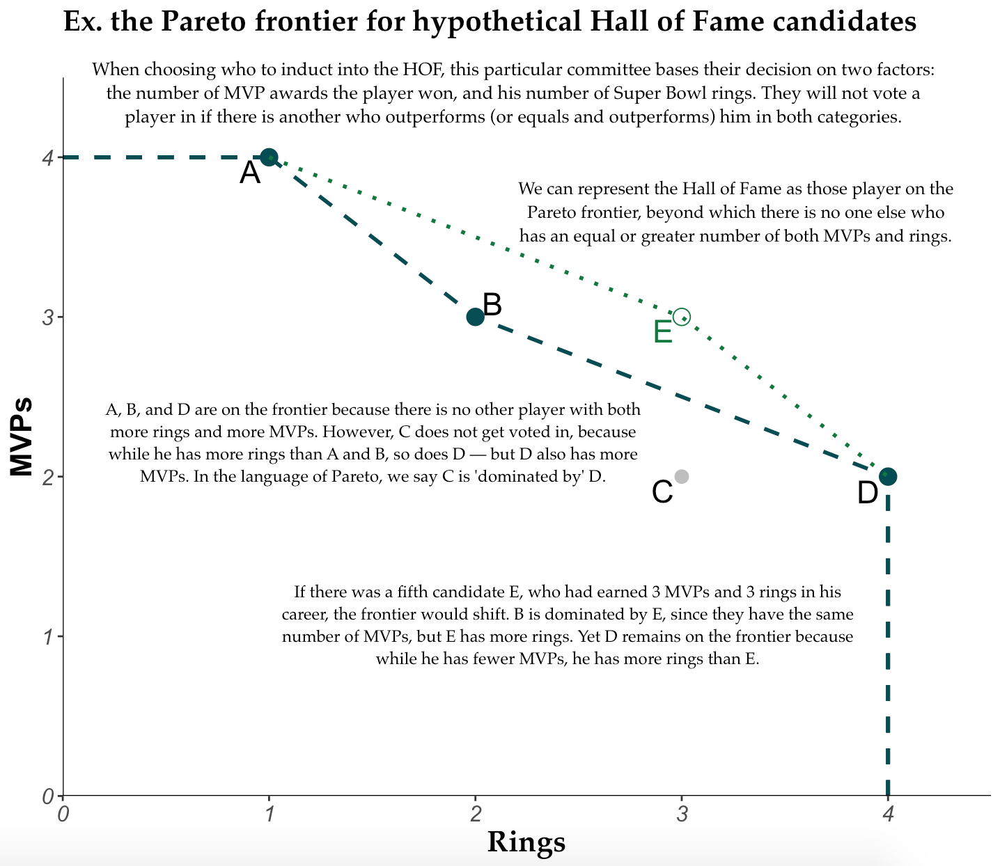

Pareto Passers
--------------

### Pareto-efficient performances through NFL history.

The repository contains scripts used to scrape from Pro-Football-Reference.com's play index finder and find the Pareto fronts for various criteria in player game logs, using Patrick Roocks's rPref package: <https://www.p-roocks.de/rpref/>

This project was inspired by an article written by Neil Paine and Andrea Jones-Rooy of FiveThirtyEight, which lays out the concept of Pareto efficiency and applies it to NBA stat lines: <https://fivethirtyeight.com/features/explaining-james-hardens-monster-game-with-a-century-old-economic-theory/>

### What is 'Pareto efficiency'?

The [Wikipedia article](https://en.wikipedia.org/wiki/Pareto_efficiency) explains the concept and its applications well. Pareto efficiency is a way of thinking about possible allocations of resources among individuals or between criteria. In particular, the Pareto efficient outcome, or the 'Pareto frontier', describes the state in which no individual or criterion can be better off or further satisfied, without hurting another individual/criterion.

To prepare you for the charts I'll eventually present, here is a hypothetical example I've put together:



The Dual-Threat Frontier
------------------------

#### Allocations of QB single-game passing and rushing yardage totals, and the Pareto frontier past which no other player has both thrown **and** rushed for more yards.

``` r
# Dependencies
library(tidyverse)
```

    ## ── Attaching packages ─────────────────────────────────────────────────── tidyverse 1.2.1 ──

    ## ✔ ggplot2 3.1.0     ✔ purrr   0.2.5
    ## ✔ tibble  1.4.2     ✔ dplyr   0.7.8
    ## ✔ tidyr   0.8.2     ✔ stringr 1.3.1
    ## ✔ readr   1.1.1     ✔ forcats 0.3.0

    ## ── Conflicts ────────────────────────────────────────────────────── tidyverse_conflicts() ──
    ## ✖ dplyr::filter() masks stats::filter()
    ## ✖ dplyr::lag()    masks stats::lag()

``` r
library(rPref)
```

    ## 
    ## Attaching package: 'rPref'

    ## The following object is masked from 'package:dplyr':
    ## 
    ##     between

``` r
library(magrittr)
```

    ## 
    ## Attaching package: 'magrittr'

    ## The following object is masked from 'package:purrr':
    ## 
    ##     set_names

    ## The following object is masked from 'package:tidyr':
    ## 
    ##     extract

``` r
library(ggrepel)

# Load data from input folder
load("input/qb_lines.Rdata")
```
