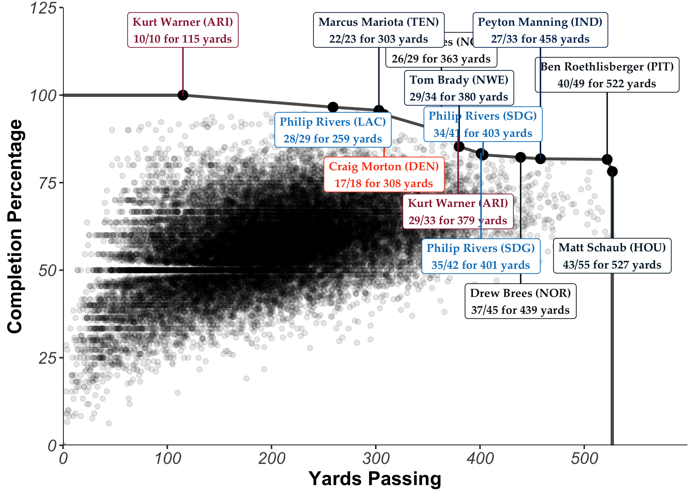

Pareto Passers
--------------

### Pareto-efficient performances through NFL history.

The repository contains scripts used to scrape from Pro-Football-Reference.com's play index finder and find the Pareto fronts for various criteria in player game logs, using Patrick Roocks's rPref package: <https://www.p-roocks.de/rpref/>

This project was inspired by an article written by Neil Paine and Andrea Jones-Rooy of FiveThirtyEight, which lays out the concept of Pareto efficiency and applies it to NBA stat lines: <https://fivethirtyeight.com/features/explaining-james-hardens-monster-game-with-a-century-old-economic-theory/>

### What is 'Pareto efficiency'?

Pareto efficiency is a way of thinking about possible allocations of resources, between individuals or criteria (in our case, statistical measures). In particular, the Pareto efficient outcome, or the 'Pareto frontier', describes the state in which no individual or criterion can be better off or improved without hurting another individual/criterion. For those of you who've taken an intro economics class, you probably encountered Pareto in the form of the "production possibility frontier". For more info, this [Wikipedia article](https://en.wikipedia.org/wiki/Pareto_efficiency) explains the concept and its applications well.

To prepare you for the charts I'll eventually present, here's an example I've put together:

### Ex. the Pareto frontier for hypothetical Hall of Fame candidates

When choosing who to induct into the HOF each year, this particular committee bases their decision on two factors alone: 1) the number of MVP awards a player won, and 2) his number of Super Bowl rings. They will not vote a player in if there is another who outperforms (or equals and outperforms) him in **both** categories. In this sense, the class of inductees are the players on the Pareto frontier, beyond which there is no other player with an equal or greater number of both MVPs and rings.
 

In this group of candidates with unimaginative parents, A, B, and D are on the frontier because there is no other player with both more rings and more MVPs. C, however, does not get voted in. While he has more rings than A and B, D has even more -- and D also earned the same amount of MVPs. In this case, C is 'dominated by' D.

If there were a fifth candidate E, who had earned 3 MVPs and 3 rings in his career, the frontier would shift. B would then become dominated by E, and fail to make the HOF.

Hopefully this helped answer any lingering questions you might have had about Pareto. Now, let's dive in with some real data!

------------------------------------------------------------------------

Gunslingers and Precision Passers
---------------------------------

#### Allocations of QB single-game passing yardage and completion percentages, and the Pareto frontier past which no other player has both thrown for more yards **and** done so at a higher completion percentage.

#### The complete stat lines of players on the frontier, by passing yardage, ascending:

| player             |     age| date       | team | opp | result  |  cmp|  att|  yds|   td|  int|    ypa|  adj\_ypa|
|:-------------------|-------:|:-----------|:-----|:----|:--------|----:|----:|----:|----:|----:|------:|---------:|
| Kurt Warner        |  34.179| 2005-12-18 | ARI  | HOU | L 19-30 |   10|   10|  115|    1|    0|  11.50|     13.50|
| Philip Rivers      |  36.352| 2018-11-25 | LAC  | ARI | W 45-10 |   28|   29|  259|    3|    0|   8.93|     11.00|
| Marcus Mariota     |  25.027| 2018-11-26 | TEN  | HOU | L 17-34 |   22|   23|  303|    2|    0|  13.17|     14.91|
| Craig Morton       |  38.234| 1981-09-27 | DEN  | SDG | W 42-24 |   17|   18|  308|    4|    0|  17.11|     21.56|
| Drew Brees         |  39.266| 2018-10-08 | NOR  | WAS | W 43-19 |   26|   29|  363|    3|    0|  12.52|     14.59|
| Kurt Warner        |  38.202| 2010-01-10 | ARI  | GNB | W 51-45 |   29|   33|  379|    5|    0|  11.48|     14.52|
| Tom Brady          |  32.076| 2009-10-18 | NWE  | TEN | W 59-0  |   29|   34|  380|    6|    0|  11.18|     14.71|
| Philip Rivers      |  31.295| 2013-09-29 | SDG  | DAL | W 30-21 |   35|   42|  401|    3|    1|   9.55|      9.90|
| Philip Rivers      |  33.279| 2015-09-13 | SDG  | DET | W 33-28 |   34|   41|  403|    2|    2|   9.83|      8.61|
| Drew Brees         |  39.237| 2018-09-09 | NOR  | TAM | L 40-48 |   37|   45|  439|    3|    0|   9.76|     11.09|
| Peyton Manning     |  28.291| 2005-01-09 | IND  | DEN | W 49-24 |   27|   33|  458|    4|    1|  13.88|     14.94|
| Ben Roethlisberger |  32.238| 2014-10-26 | PIT  | IND | W 51-34 |   40|   49|  522|    6|    0|  10.65|     13.10|
| Matt Schaub        |  31.146| 2012-11-18 | HOU  | JAX | W 43-37 |   43|   55|  527|    5|    2|   9.58|      9.76|

------------------------------------------------------------------------

The Dual-Threat Frontier
------------------------

#### Allocations of QB single-game passing and rushing yardage totals, and the Pareto frontier past which no other player has both thrown **and** rushed for more yards.

#### The players on the frontier, from lowest to highest rushing total:

| player           |     age| date       | team | opp | result  |  cmp|  att|  yds|   td|  int|  rush|  rush\_yds|  rush\_td|
|:-----------------|-------:|:-----------|:-----|:----|:--------|----:|----:|----:|----:|----:|-----:|----------:|---------:|
| Warren Moon      |  34.028| 1990-12-16 | HOU  | KAN | W 27-10 |   27|   45|  527|    3|    0|     4|          2|         0|
| Tom Brady        |  34.040| 2011-09-12 | NWE  | MIA | W 38-24 |   32|   48|  517|    4|    1|     1|          3|         0|
| Derek Carr       |  25.216| 2016-10-30 | OAK  | TAM | W 30-24 |   40|   59|  513|    4|    0|     1|         13|         0|
| Matt Ryan        |  31.138| 2016-10-02 | ATL  | CAR | W 48-33 |   28|   37|  503|    4|    1|     4|         14|         0|
| Patrick Mahomes  |  23.063| 2018-11-19 | KAN  | LAR | L 51-54 |   33|   46|  478|    6|    3|     6|         28|         0|
| Russell Wilson   |  28.334| 2017-10-29 | SEA  | HOU | W 41-38 |   26|   41|  452|    4|    1|     4|         30|         0|
| Steve Young      |  30.338| 1992-09-13 | SFO  | BUF | L 31-34 |   26|   37|  449|    3|    1|     7|         50|         0|
| Cam Newton       |  22.130| 2011-09-18 | CAR  | GNB | L 23-30 |   28|   46|  432|    1|    3|    10|         53|         1|
| Michael Vick     |  31.098| 2011-10-02 | PHI  | SFO | L 23-24 |   30|   46|  416|    2|    1|     8|         75|         0|
| Cam Newton       |  26.223| 2015-12-20 | CAR  | NYG | W 38-35 |   25|   45|  340|    5|    0|     8|        100|         0|
| Russell Wilson   |  25.324| 2014-10-19 | SEA  | STL | L 26-28 |   23|   36|  313|    2|    0|     7|        106|         1|
| Colin Kaepernick |  29.024| 2016-11-27 | SFO  | MIA | L 24-31 |   29|   46|  296|    3|    1|    10|        113|         0|
| Cam Newton       |  23.212| 2012-12-09 | CAR  | ATL | W 30-20 |   23|   35|  287|    2|    0|     9|        116|         1|
| Colin Kaepernick |  25.070| 2013-01-12 | SFO  | GNB | W 45-31 |   17|   31|  263|    2|    1|    16|        181|         2|

------------------------------------------------------------------------

Try it out yourself! Clone this repo and run app.R in the custom\_frontier directory.
-------------------------------------------------------------------------------------
